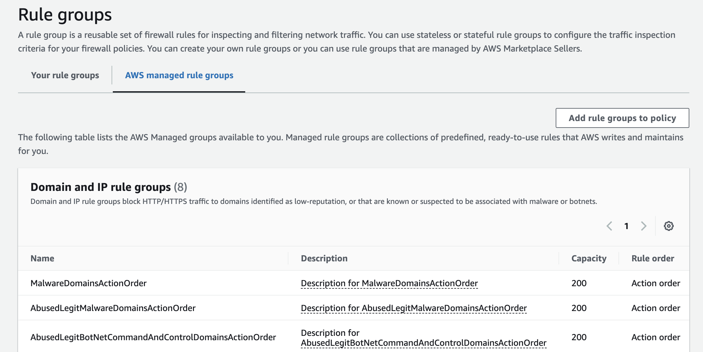
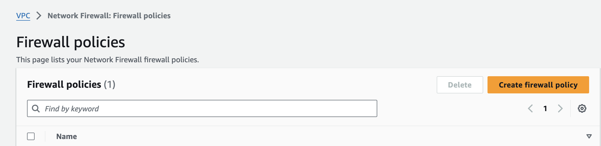
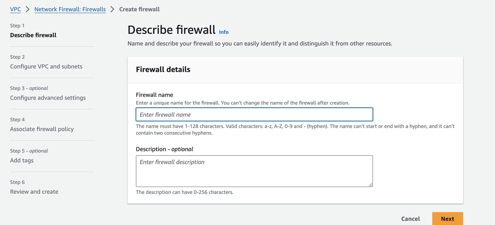

### Why do we need it?

With AWS Network Firewall, you can create firewall rules that provide fine-grained control over network traffic and easily deploy firewall security across your VPCs. (1*)

### How it works?

1. Define **firewall rules** that provide fine-grained control over network traffic.

- 

2. Network Firewall works together with AWS Firewall Manager so you can build **policies** based on Network Firewall rules and

- 

3. then centrally apply those policies across your VPCs and accounts.

- 

### References

1* https://aws.amazon.com/network-firewall/